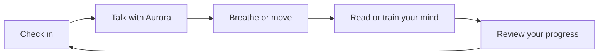
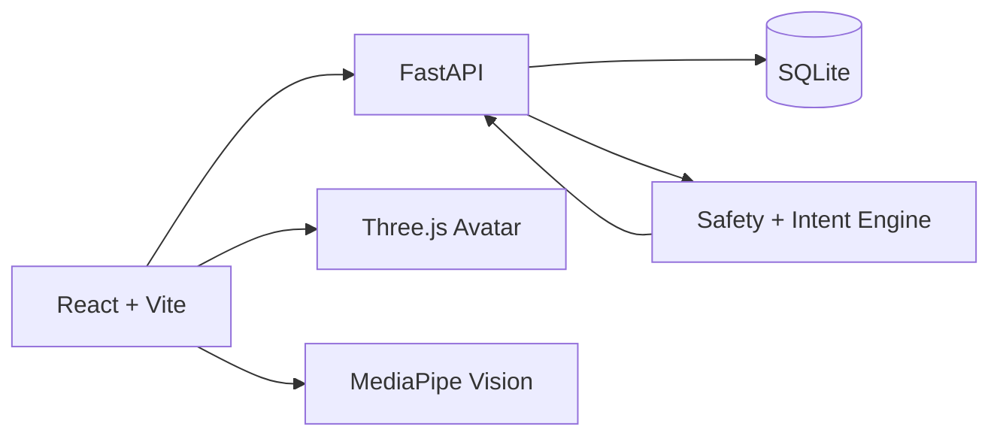

<div align="center">

# ✦ MindAura

### Your private, interactive space to talk, breathe, reflect, move, and grow


<a href="https://git.io/typing-svg"></a>

[](https://ai-companion-coral-chi.vercel.app)
[](https://react.dev/)
[](https://fastapi.tiangolo.com/)
[](https://vite.dev/)
[](https://ai-companion-nhxy.onrender.com/health)

**[🌐 Experience the live app](https://ai-companion-coral-chi.vercel.app)** · **[✨ Explore features](#-the-mindaura-experience)** · **[🧠 Browse games](#-a-30-game-cognitive-studio)** · **[🚀 Run locally](#-run-locally)**

</div>

---

## 🌌 What is MindAura?

MindAura brings supportive conversation, mood awareness, mindful breathing,
movement, therapeutic sound, personal-growth reading, and cognitive play into
one focused experience. Aurora responds to common emotional needs with distinct,
practical guidance while keeping clear boundaries around crisis support,
diagnosis, and abusive language.

<div align="center">

| 7 wellness spaces | 30 mind games | Voice-enabled | 3D companion | Private analytics |
|:---:|:---:|:---:|:---:|:---:|
| One calm home | Play and practise | Speak and listen | Emotion-aware motion | Session-isolated data |

</div>

> [!IMPORTANT]
> MindAura is an educational wellness-support project. It is not a replacement
> for professional medical advice, diagnosis, therapy, or emergency care.

## ✨ The MindAura experience

| Space | What you can do |
|---|---|
| **Aurora Companion** | Have natural, intent-aware conversations with voice input and spoken replies |
| **Mood Dashboard** | Log daily mood, follow streaks, and review private session activity |
| **Meditation Studio** | Use guided breathing, calm timers, and mindful sessions |
| **Move & Yoga** | Follow structured exercises and camera-assisted posture experiences |
| **Sound Therapy** | Explore relaxing playlists, playback controls, and sleep timers |
| **Growth Library** | Read curated personal-growth material and save favourites |
| **Mind Games** | Play 30 exercises across memory, focus, language, speed, math, and logic |



### 🧠 A 30-game cognitive studio

The game library includes Memory Match, 2048, Wordle, Sudoku, Simon Says,
Typing Speed, Trivia, Pattern Recall, Mental Math, Word Hunt, Grid Navigator,
Logic Gates, Reflex Trainer, 2-Back Focus, Mindful Recall, Odd One Out, and more.

### 🛡️ Safety by design

- Crisis language receives immediate, region-relevant support guidance.
- English and Hindi/Hinglish abusive language—including common evasive spellings—is rejected.
- Rejected abusive content is not stored in conversation history.
- Wellness analytics are isolated by session rather than shared across users.
- Aurora does not diagnose conditions or present itself as a therapist.

## 🏗️ Architecture



| Layer | Technology |
|---|---|
| Interface | React 18, Vite, CSS, Lucide React |
| Interactive media | Three.js, MediaPipe Tasks Vision, Web Speech APIs |
| API | Python, FastAPI, Pydantic, Uvicorn |
| Storage | SQLite |
| Production | Vercel frontend with configurable backend URL |

## 💬 Conversation intelligence

Aurora uses a safety-first intent engine to recognise what kind of support a
message needs before selecting a response. It provides dedicated conversational
paths for motivation, anxiety, overwhelm, grounding, sadness, anger, loneliness,
sleep, gratitude, and open sharing. Multiple responses per intent keep the
experience natural, while strict moderation and crisis routing run first.

```text
Message → Safety check → Intent detection → Support strategy → Natural response
             │
             ├── Crisis language → Immediate support guidance
             └── Abuse detected → Reject without storing the message
```

## 🚀 Run locally

### 1. Start the API

```bash
cd mental-health-backend
python -m venv .venv
source .venv/bin/activate
pip install -r requirements.txt
uvicorn app:app --reload
```

The API is available at `http://127.0.0.1:8000`; interactive documentation is
available at `http://127.0.0.1:8000/docs`.

### 2. Start the interface

```bash
cd FRONTEND
npm install
npm run dev
```

Open the local address printed by Vite.

## ⚙️ Production configuration

| Variable | Purpose |
|---|---|
| `VITE_API_URL` | Public URL of the deployed FastAPI service |
| `AURORA_SECRET_KEY` | Strong private signing secret for authentication tokens |
| `AURORA_DB_PATH` | Optional SQLite database location |
| `CORS_ORIGINS` | Comma-separated trusted frontend origins |

Never commit production secrets or local `.env` files.

## ✅ Quality checks

Every release is checked for:

- Production frontend compilation and route chunking
- Backend import and API health
- Authentication and token validation
- Exact prompt responses for motivation, anxiety, calming, overwhelm, and sharing
- Abuse spelling variations and rejected-message storage safety
- Crisis-response priority
- Per-session analytics isolation
- Responsive keyboard- and touch-friendly controls

## 📁 Project map

```text
AI-COMPANION/
├── FRONTEND/
│   ├── public/
│   ├── src/
│   │   ├── components/
│   │   ├── pages/
│   │   └── services/
│   └── package.json
├── mental-health-backend/
│   ├── app.py
│   ├── main.py
│   └── requirements.txt
└── README.md
```

## 🤝 Contributing

Thoughtful improvements are welcome. Please open an issue for substantial
changes and keep accessibility, privacy, emotional safety, and mobile usability
at the centre of every contribution.

1. Fork the repository and create a focused branch.
2. Keep changes accessible and responsive.
3. Run the frontend production build and backend checks.
4. Open a pull request explaining the user-facing improvement.

---

<div align="center">

Built with care by [Khushi Soni](https://github.com/khushisoni2004)

**Pause. Breathe. Begin again.**

</div>
